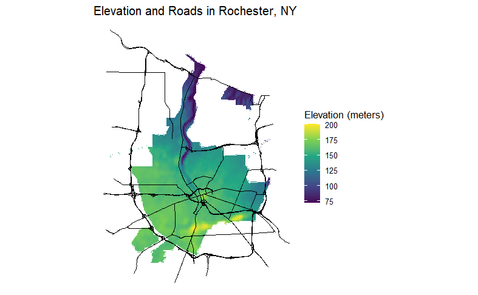

I recently learned how to do maps in an R data visualization class at school. I found it pretty interesting. For example, here is a map I made for Rochester, New York that shows major roads and elevation. We were told we could make this as simple or as cool as we wanted, so I actually tried to do something unique and cool. I've always loved topographical maps because I love war history, and topography is key to understanding much of war strategy.



### Chinese demographics in Litchfield County, CT

Later, there was a bonus (worth 0 points?!) to make an interactive map on your own. They did not actually teach us how to do the interactive part, so it was entirely up to us whether we wanted to teach ourselves or not. After doing a lot of digging and research, I figured out how to make an interactive map for the Chinese population in Litchfield County, Connecticut. I was specifically interested in this particular county because I am Chinese and grew up in New Milford, a town in Litchfield County.

```{r setup, include=FALSE}

library(tidycensus)
library(viridis)
library(tidyverse)
library(leaflet)
```

```{r, include = FALSE}

litchfield <- get_acs(
  state = "CT",
  county = "Litchfield",
  geography = "tract",
  variables = "B02018_007",
  geometry = TRUE,
  year = 2020,
  progress_bar = FALSE
)

# Set color palette for map
pal <- colorNumeric(
  palette = "viridis",
  domain = litchfield$estimate
)
```

```{r, echo = FALSE, fig.align = 'center'}
leaflet() %>% 
  setView(-73.2400, 41.7900, zoom = 9) %>% 
  addPolygons(data = litchfield,
              color = ~ pal(estimate),
              label = ~ estimate,
              weight = 0.5,
              fillOpacity = 0.5) %>% 
  addProviderTiles('CartoDB.Positron') %>% 
  addLegend(
    position = "topright",
    pal = pal,
    values = litchfield$estimate,
    title = "# of Chinese"
  )
```

What can we learn from this map? There appears to be 4 main concentrations of Chinese people around Litchfield County: New Milford (yellow), Kent on the middle-left (green), Salisbury on the top-left (blue), and some patches of turquoise near Waterbury on the bottom-right.

Now if you are from the area, you will know that Waterbury is quite big of a city, so it's entirely unsurprising that there are more Chinese people living in their suburbs. Additionally, New Milford is the last sizeable population aside from Torrington before going any further north, and also acts somewhat like a suburb of Danbury. It makes sense that there are some Chinese residents here. However, Kent and Salisbury are a little more puzzling: both have about two streets in their town. Even New Milford having 103 people in that one yellow census tract is extremely surprising: having lived there, I basically knew almost every Chinese family in town and could basically count them on my fingers. Where were they all?

Well it turns out, what New Milford, Kent, and Salisbury all have in common are private schools. The rich, old money, elite kind. In New Milford, we have the Canterbury School. Kent has the Kent School, and Salisbury has perhaps the most notorious of the three, the Hotchkiss School. Rich Chinese families are sending their kids to these private schools. There are probably a bunch of Chinese students within Canterbury's campus that I have simply never seen before (I attended the town's public school, New Milford High School).

I hope you found this interesting!
